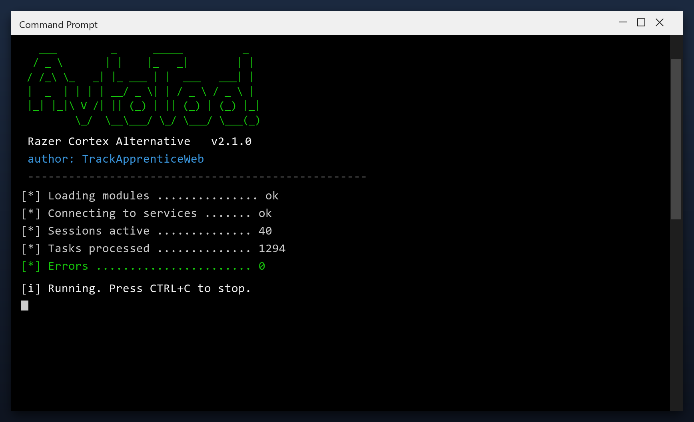

# Razer Cortex Alternative — Free Download [2026]

  

**At a glance**

| | |
| --- | --- |
| **Program** | Razer Cortex Alternative |
| **Version** | Latest 2026 build |
| **Price** | Free |
| **Systems** | see requirements below |
| **Download** | Quick Start section below |

---

Razer cortex alternative is a lightweight Windows program for maintaining your system. It runs offline, uses very little memory and does not slow your computer down. **Completely free.**

  

## 1. Overview

Think of razer cortex alternative as a housekeeper for your computer. Over time, files pile up that nobody uses - installers you ran once, caches, old logs. The tool finds those piles and clears them, which frees space and often speeds the PC up.

| **Term** | **Meaning** |
| --- | --- |
| **Cache** | Saved data that can be rebuilt |
| **Leftover** | A file an uninstall forgot |
| **Duplicate** | The same file stored twice |
| **Free space** | Room available on your drive |

## 2. Technical Details

| **Feature** | **Details** |
| --- | --- |
| **Interface** | Single window, no clutter |
| **Learning curve** | None - obvious buttons |
| **Languages** | English |
| **Permissions** | Admin for some tasks |
| **Conflicts** | None with other tools |
| **Uninstall** | Clean, leaves nothing behind |

## 3. System Requirements

| **Component** | **Minimum** | **Recommended** |
| --- | --- | --- |
| **OS** | Windows 10 | Windows 11 (64-bit) |
| **RAM** | 2 GB | 4 GB |
| **Disk** | 100 MB free | 500 MB free |
| **Network** | For download | For updates |

## 4. Installation

1. **Get the file** with the button below
2. **Allow** it in Windows SmartScreen (More info, Run anyway)
3. **Open** the tool
4. **Press Start scan** and wait a couple of minutes
5. **Click Clean** to remove what was found

  

> **Note:** make sure your work is saved before a deep clean. The tool creates a restore point, but saving first is always wise.

## 5. What's Included

| **Component** | **Details** |
| --- | --- |
| **Program** | Tested, clean build |
| **Instructions** | Quick start guide |
| **Requirements** | Listed below |
| **License** | Free for personal use |

## 6. Comparison

| **Feature** | **Windows built-in** | **razer cortex alternative** |
| --- | --- | --- |
| **Depth** | Basic | Detailed |
| **Categories** | One | Many |
| **Report** | Minimal | Plain-language |
| **Scheduling** | Limited | Built in |

## 7. Common Issues

| **Issue** | **Fix** |
| --- | --- |
| **Missing DLL error** | Install the Visual C++ runtime |
| **Crash on startup** | Update Windows and retry |
| **Report looks empty** | Run a deep scan instead of a quick one |
| **Cannot uninstall** | Use Windows Settings, Apps |

## 8. Maintenance Tips

- Do not run two cleaners at the same time
- Use the preview to see what will be removed
- Keep the restore point until you are sure
- Re-scan after installing big programs
- Back up documents before any deep clean

## 9. Frequently Asked Questions

**Is admin access required?**

For a full cleanup, yes. Without it the tool only cleans your user folders.

**Will it fix my registry?**

It can scan and repair broken entries, and it backs up before changing anything.

**Does it work offline?**

Yes - once downloaded it needs no internet connection.

**How much space will I save?**

It varies, but most PCs recover several gigabytes on the first run.

---

*sparkling-topaz-723 · Updated 2026-10-10 · Shared under the MIT License*
